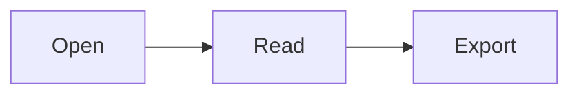

# Rendering check

A paragraph with **bold**, *italic*, ~~strike~~, ==highlight==, `inline code` and a [link](https://example.com).

## Tasks

- [ ] open task alpha
- [x] done task beta

## Table

| Interface | Description | Status |
|-----------|-------------|--------|
| eth1/1 | Uplink toward the aggregation switch | Up |
| eth1/2 | Server port | Down |

## Code

```swift
let greeting = "hello"
print(greeting)
```

## Math

Inline math $E = mc^2$ and a block:

$$
\int_0^1 x^2 \, dx = \frac{1}{3}
$$

## Diagram



> [!NOTE]
> Alerts render as callouts.

### Needle section

The word needle appears here, and needle again.
